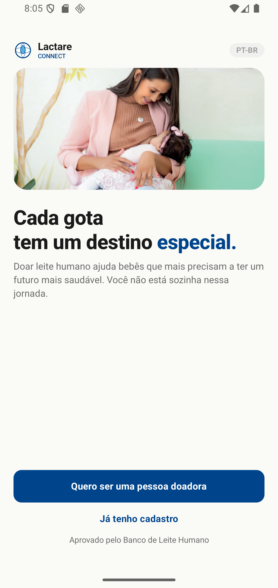
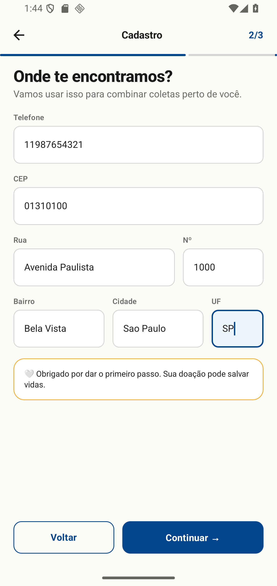
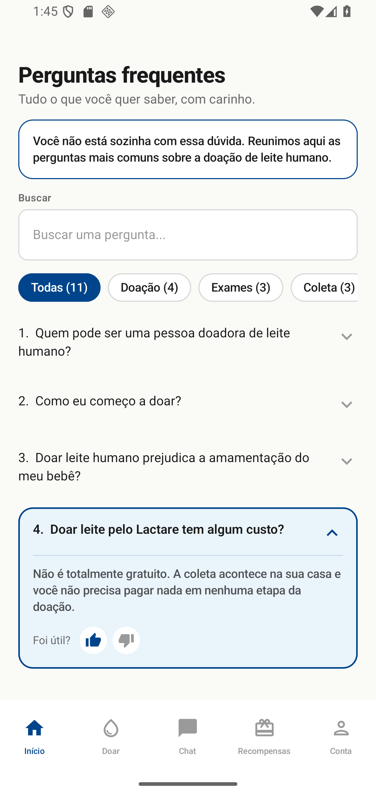
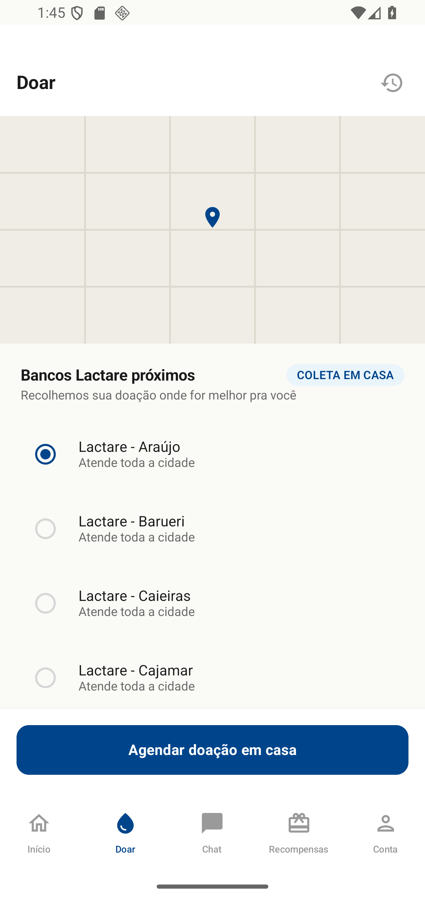
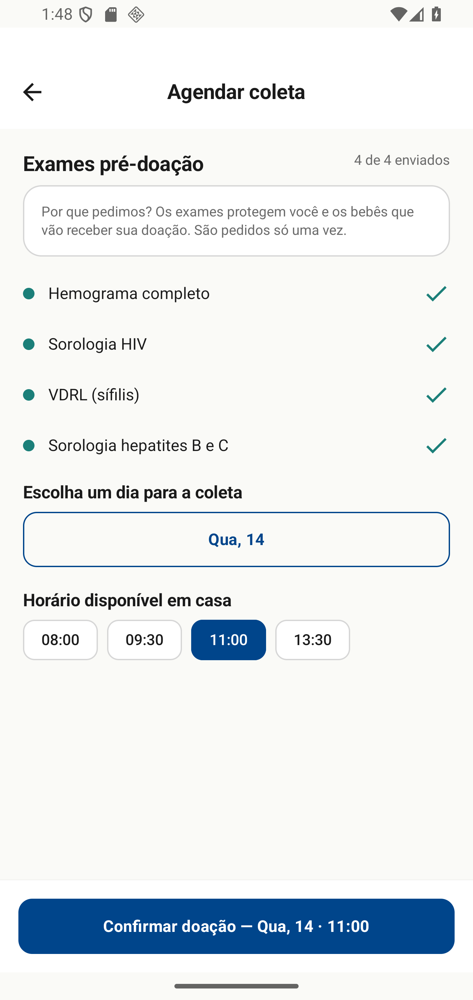
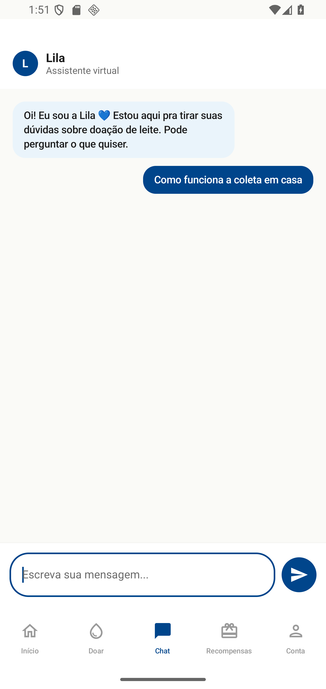
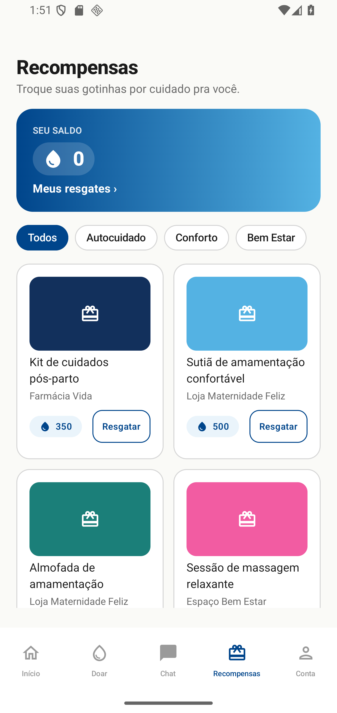
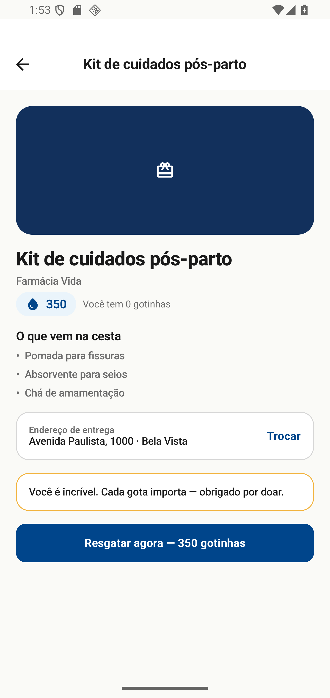
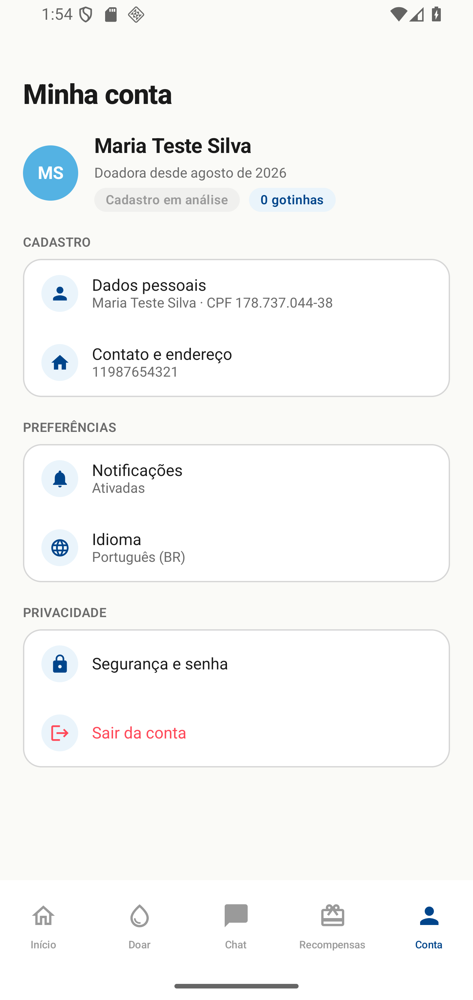

# Lactare Connect

Aplicativo Android (Kotlin + Jetpack Compose) para conectar doadoras de leite materno a bancos de leite humano, facilitando cadastro, agendamento de coleta domiciliar e acompanhamento do processo de doação.

## Equipe

**Nome da equipe:** Lactare Connect

**Integrantes:**
- Davi Fiszbejn
- Leonardo Silva Oliveira
- Augusto Tomaselli

## Sobre o projeto

O Lactare Connect resolve um problema prático de bancos de leite humano: facilitar e humanizar o processo de doação de leite materno. Pelo app, a doadora se cadastra, envia os exames pré-doação exigidos, agenda a coleta — sempre feita em casa, sem necessidade de deslocamento até um posto físico — e acompanha o andamento pelo aplicativo. Como incentivo, cada doação gera "Gotinhas", uma moeda interna trocável por recompensas (produtos de autocuidado, conforto e bem-estar).

Nesta Sprint o app é uma versão navegável com dados mockados: não há integração com API, Firebase ou banco de dados — o foco é validar fluxo, interface e navegação da solução proposta.

## Repositório

https://github.com/Fiszbejn/Sprint3_AKD_LactareConnect

## Prints das telas

> Capturas reais do app rodando no emulador Android (Pixel 4 XL, API 36).

### Boas-vindas / Autenticação


Tela inicial do app, com opções para criar cadastro como doadora ou fazer login para quem já tem conta.

### Cadastro (3 passos)


Wizard de cadastro dividido em três etapas: dados de identidade, contato/endereço e definição de senha.

### Início (FAQ)


Tela inicial pós-login, com perguntas frequentes organizadas por categoria (Doação, Exames, Coleta, Armazenamento), busca e exibição em formato accordion.

### Doar — Mapa de bancos


Lista dos bancos de leite Lactare disponíveis para vincular a doação, com seleção via rádio button.

### Doar — Agendamento de coleta


Envio dos exames pré-doação exigidos, seleção de dia (dropdown) e horário (chips) para a coleta domiciliar, com confirmação habilitada apenas quando todas as etapas estão completas.

### Chat


Conversa com a assistente virtual Lila, para tirar dúvidas sobre o processo de doação.

### Recompensas
 

Catálogo de recompensas trocáveis por Gotinhas, organizado por categoria (Autocuidado, Conforto, Bem Estar), com tela de detalhe e resgate.

### Conta


Perfil da doadora, com seções de dados de cadastro, preferências e privacidade.

## Vídeo de demonstração

https://drive.google.com/file/d/1eaotC7Y8datFvU_D4UzVkuCgJZvPgCup/view?usp=sharing

Vídeo mostrando a navegação pelo app: cadastro completo, fluxo de doação (mapa + agendamento com envio de exames), chat, resgate de recompensa e tela de conta.

## Arquitetura e organização do código

- **Kotlin + Jetpack Compose** (100% Compose, sem XML de layout).
- **Navigation Compose** para navegação entre telas, com passagem de parâmetros (ex.: id da recompensa selecionada) e controle de back stack.
- Estrutura de pacotes por responsabilidade:
  - `ui/theme` — cores, tipografia e tema do app.
  - `ui/components` — componentes visuais reutilizáveis (`LcButton`, `LcInput`, `LcHeader`, etc.).
  - `ui/navigation` — rotas e tab bar.
  - `ui/screens/<feature>` — telas organizadas por funcionalidade (onboarding, faq, doar, chat, rewards, conta).
  - `data/model` — modelos de dados do domínio.
  - `data/mock` — dataset mockado usado por todas as telas.
- Sem backend, API, Firebase ou banco de dados local nesta Sprint — todos os dados vêm de `MockData.kt`.

## Como executar

**Pré-requisitos:** Android Studio (versão atual), JDK 17+.

1. Abra a pasta do projeto no Android Studio (`File > Open`).
2. Aguarde a sincronização do Gradle.
3. Selecione um emulador (ou dispositivo físico com depuração USB habilitada).
4. Rode o app com o botão **Run** (▶) ou `Shift+F10`.

Alternativamente, via linha de comando (na raiz do projeto):

```bash
./gradlew assembleDebug
```

O APK de debug é gerado em `app/build/outputs/apk/debug/`.
